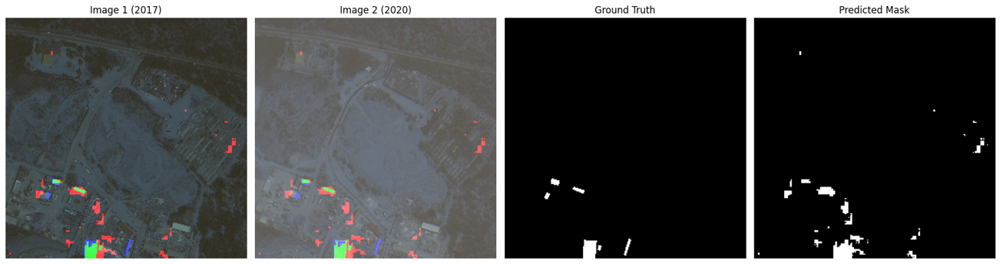
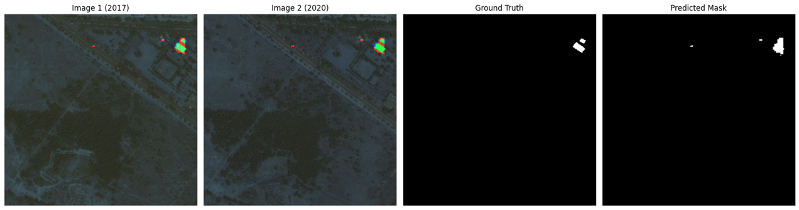
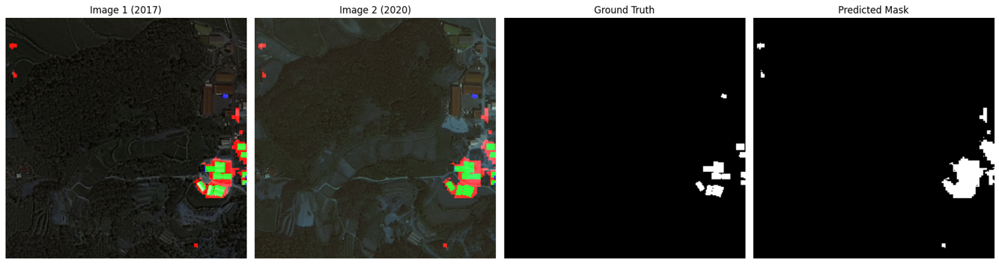
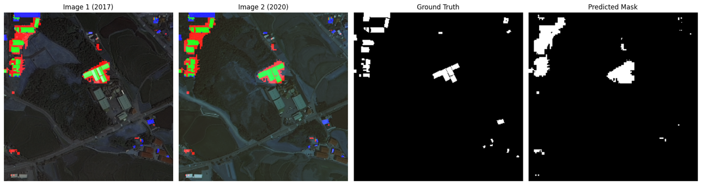
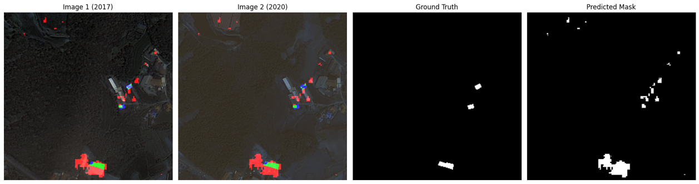

# 🛰️ Satellite Building Change Detection
___
This project utilizes Deep Learning techniques to automatically detect changes in buildings (construction, demolition, or modification) using bi-temporal satellite imagery. 

It implements a Siamese U-Net architecture to process image pairs and generate binary change maps.

___
## Dataset

The model was trained and evaluated on the S2Looking dataset.
Dataset Source: [S2Looking generated dataset](https://www.kaggle.com/datasets/ktncktnc/s2looking-generated-dataset)

___
## Methodology & Architecture

The core of the project is the Siamese U-Net Diff architecture, designed to handle the challenges of remote sensing change detection.

### Pipeline Overview

**Siamese Input**:

The network accepts two images covering the same area at different times ($t_1$ and $t_2$).

**Shared Encoder**:

Both images pass through a shared encoder based on the U-Net backbone. 
This extracts features from both images using identical weights.

**Feature Difference**: 

The model calculates the difference between the feature maps of the two timestamps.

**Decoder**:

The difference features are upsampled and processed by the decoder to reconstruct the spatial resolution.

**Output**: 

A binary change map (1 = Change, 0 = No Change).

**Training Configuration** 
- Loss Function: Binary Cross Entropy (BCE).
- Primary Metric: F1-Score (chosen due to the high class imbalance between "background" and "change" pixels).

___
### Evaluation Results

The model was evaluated on the test set, yielding the following performance metrics:

| Metric | Result | Interpretation |
| :--- | :--- | :--- |
| **Accuracy** | 0.881 | Percentage of correctly classified pixels. The high value is misleading due to the dominance of background pixels (class imbalance). |
| **Recall** | 0.454 | Percentage of actual building changes successfully detected by the model (True Positive Rate). |
| **Precision** | 0.361 | Ratio of correctly detected change pixels to all pixels predicted as changes (False Alarm rate check). |
| **F1-Score** | 0.403 | Harmonic mean of Precision and Recall. Considered the most reliable quality indicator for this specific task. |
| **IoU**  | 0.245  | Intersection between predicted mask and ground truth.  |

- The discrepancy between the high Accuracy (0.881) and lower IoU (0.245) confirms a class imbalance problem typical in satellite imagery (most of the map is "no change"). 

- The F1-score of ~0.4 indicates that the model is functional but highlights a trade-off between false alarms (Precision) and missed detections (Recall).
___
### Results visualisation. 

**Legend**
- Green colour: True positive. Correct prediciton. 
- Red colour: False positive. Model predicted change, but it shouldn't.
- Blue colour: False negative Model didn't predict change, but change took place in this pixels. 

  

- Predictions correctly indicated areas where changes took place, but details are low quality.
  
- Changes in natural environment, eg. farms can easly confuse model's predictions.

